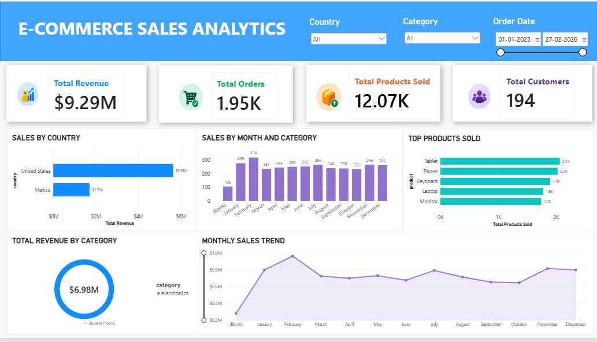

# E-Commerce Sales Analytics

## Project Overview
This project performs **data cleaning, exploration, SQL analysis, and visualization** on e-commerce sales data. Using **Python, PostgreSQL, SQL, and Power BI**, it extracts useful business insights about sales, products, customers, countries, and monthly trends to support **data-driven decision-making**.

---

## Objectives
- Clean and prepare raw e-commerce data.
- Explore customer, product, order, and sales information.
- Analyze:
  - Total revenue and orders.
  - Product sales performance.
  - Country-wise sales.
  - Category-wise revenue.
  - Monthly sales trends.
  - Customer performance.
- Build an interactive **Power BI dashboard** to visualize key business KPIs.

---

## Files

| File | Description |
|------|--------------|
| `ecommerce_data.csv` | Raw e-commerce sales dataset. |
| `ecommerce_data_cleaning.ipynb` | Python notebook for EDA and data cleaning. |
| `ecommerce_sales_analysis.sql` | SQL script containing table creation and analytical queries. |

---

## Workflow Summary

### 1. Data Loading
The raw CSV dataset was loaded into Python using **Pandas**.

```python
import pandas as pd
df = pd.read_csv("ecommerce_data.csv")
```

### 2. Data Exploration
- Checked dataset structure and data types.
- Identified missing values.
- Checked duplicate records.
- Examined unique countries and categories.
- Analyzed product and order information.

### 3. Data Cleaning
- Handled missing customer names and emails.
- Standardized country names.
- Converted `order_date` into the appropriate date format.
- Checked and handled duplicate records.
- Validated numerical columns.
- Exported the cleaned dataset to CSV.

### 4. SQL Analysis
The cleaned data was loaded into **PostgreSQL** and analyzed using SQL.

| Query | Description |
|-------|--------------|
| Q1 | Total sales by country |
| Q2 | Total units sold by product |
| Q3 | Overall total revenue |
| Q4 | Monthly sales |
| Q5 | Total orders by country |
| Q6 | Top-performing products |
| Q7 | Category-wise revenue |
| Q8 | Average order value |

---

## Tools Used
- Python
- Pandas
- Jupyter Notebook
- PostgreSQL
- SQL
- Power BI
- DAX

---

## 📊 Power BI Dashboard
The Power BI dashboard provides an interactive overview of e-commerce performance.

### Key KPIs
- **Total Revenue**
- **Total Orders**
- **Total Products Sold**
- **Total Customers**

### Visualizations
- Sales by Country
- Sales by Month & Category
- Top Products Sold
- Total Revenue by Category
- Monthly Sales Trend

The dashboard also includes interactive filters for:
- **Country**
- **Category**
- **Order Date**



---

## 📈 Key Insights
- Identified the countries contributing the highest revenue.
- Identified the products with the highest sales volume.
- Compared revenue contribution across product categories.
- Analyzed monthly sales patterns and trends.
- Calculated overall revenue, orders, products sold, and customer count.
- Used interactive Power BI visuals to make the analysis easier to interpret.

---
